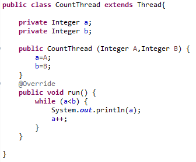
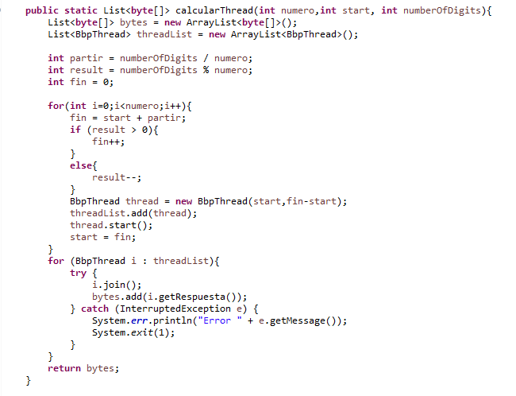
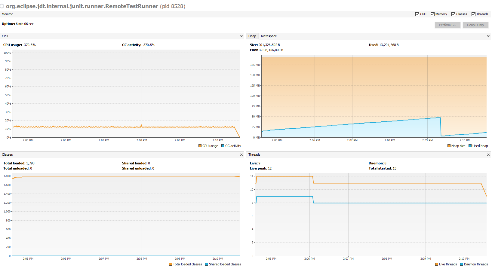
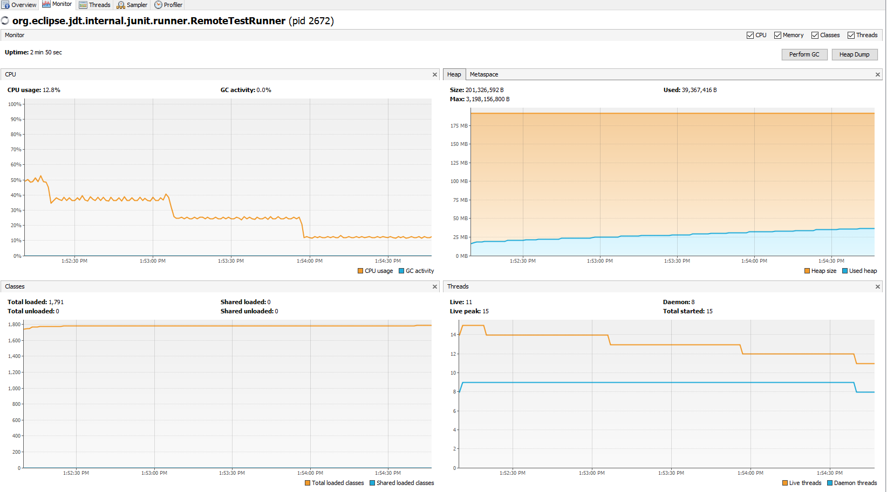
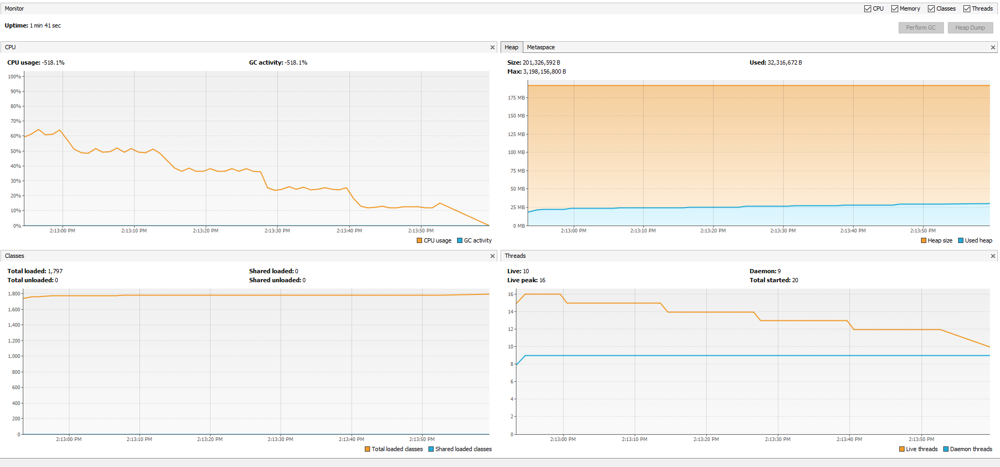
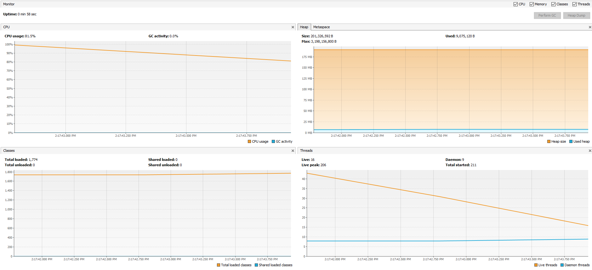
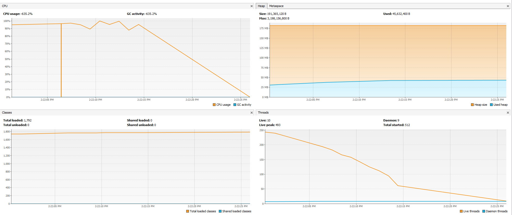

## BBP Formula

### Compile and run instructions

Entrar al directorio ARSW-LAB-01/BBP_FORMULA/PARALLELISM-JAVA_THREADS_MAVEN-INTRODUCTION_BBP_FORMULA

### Para compilar:
Ejecutar mvn package

### Para ejecutar las pruebas: 
mvn test

### Para ejecutar CountThread: 
mvn exec:java -Dexec.mainClass="edu.eci.arsw.threads.CountThreadsMain"

### Part I - Introduction to Java Threads
1. As reviewed in the readings, complete the CountThread classes, so that they define the life cycle of a thread that prints the numbers between A and B. 
2. Complete the main method of the CountMainThreads class so that: 

2.1 Create 3 threads of type CountThread, assigning the first one the interval [0..99], the second one [99..199], and the third one [200..299]. 

2.2 Start all three threads with start(). 

2.3 Run and check the output on screen.

2.4 Change the beginning with start() to run(). How does the output change? Why?

El metodo run() invoca a la funcion que se ejecuta en el main por eso los numeros salen ordenados, en cambio el metodo start() ejecuta varios procesos al mismo tiempo por eso vemos que los numeros no se muestran de manera ordenada.

### Part II - BBP Formula Exercise

1. Create a Thread type class that represents the life cycle of a thread that calculates a portion of the required digits.

2. Have the PiDigits.getDigits() function receive as an additional parameter an N value, corresponding to the number of threads between which the solution is to be parallelized. Have that function wait until the N threads finish solving the problem to combine the answers and then return the result. For this, review the join method of the Java concurrency API. 

### Part III - Performance Evaluation

1. Single thread. 

2. As many threads as processing cores (have the program determine this using the Runtime API). 

3. So many threads as double processing cores. 

4. 200 threads.

5. 500 threads/59 segundos

1. Al aumentar la cantidad de hilos se divide la tarea demasiado por lo que lleva a que el tiempo aumente

2. Utilizar el doble de hilos que procesadores reduce el tiempo de ejecucion y es viable ya que se reduci el tiempo de ejcucion y los procesadores no tienen una carga excesiva que le permita cumplir su funcion.

3. Entre mas CPUs se utlicen se reduce la carga para cada procesador por lo que no se estaria usando de manera completa cada procesador
