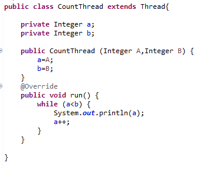
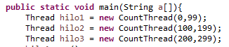
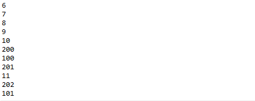
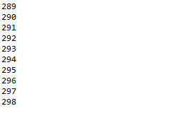

## BBP Formula

### Compile and run instructions

Entrar al directorio ARSW-LAB-01/BBP_FORMULA/PARALLELISM-JAVA_THREADS_MAVEN-INTRODUCTION_BBP_FORMULA

Para compilar: Ejecutar mvn package

### Para ejecutar CountThread: 
mvn exec:java -Dexec.mainClass="edu.eci.arsw.threads.CountThreadsMain"

### Part I - Introduction to Java Threads
1. As reviewed in the readings, complete the CountThread classes, so that they define the life cycle of a thread that prints the numbers between A and B. 
2. Complete the main method of the CountMainThreads class so that: 

2.1 Create 3 threads of type CountThread, assigning the first one the interval [0..99], the second one [99..199], and the third one [200..299]. 

2.2 Start all three threads with start(). 

2.3 Run and check the output on screen.

2.4 Change the beginning with start() to run(). How does the output change? Why?

El metodo run() no ejecuta de forma asincrona por lo que debe esperar a que termine cada hilo, en cambio el metodo start() ejecuta varios procesos al mismo tiempo por eso vemos que los numeros no se muestran de manera ordenada.
