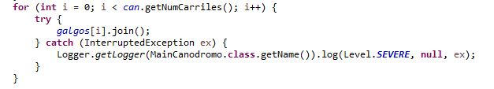
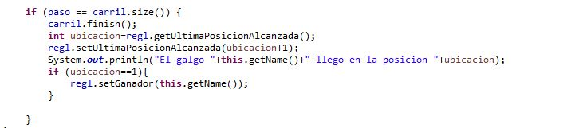
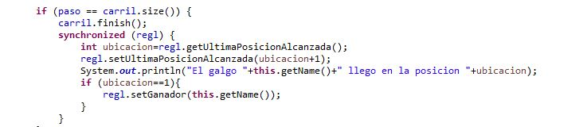

# Dogs Race Case

## Compile and run instructions

Entrar al directorio `ARSW-LAB-01/DOGS_RACE/CONCURRENT_PROGRAMMING-JAVA_MAVEN-DOGS_RACE/parte2`

 **Para compilar:** Ejecutar `mvn package`
-**Para ejecutar PrimeFinder:** Ejecutar `mvn exec:java -Dexec.mainClass="arsw.threads.MainCanodromo`

## Part III

1. Añadir el metodo join() para ver el resultado de la carrera una vez finalizada.

2. En esta parte de código perteneciente a la clase `Galgo.java` en la función `corra()` encontramos la región critica.

Solución
Se sincroniza esta parte de código haciendo referencia a _regl_ en `synchronized( regl )` ya que es accedida por los demás Threads a su función de incremento de posición.

